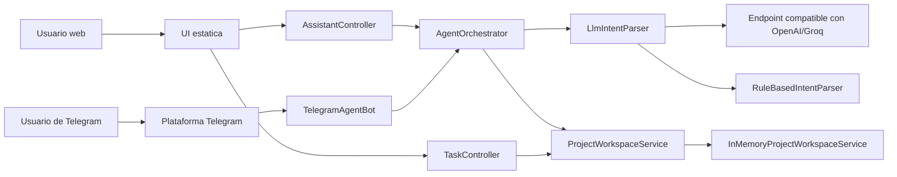

# Arquitectura

Esta fase es una aplicacion Spring Boot que expone un bot de Telegram, controladores REST y una UI web estatica en el mismo runtime.

## Flujo principal



## Responsabilidades principales

| Componente | Responsabilidad | Ubicacion |
| --- | --- | --- |
| **TelegramAgentBot** | Recibe updates del long polling de Telegram, los procesa mediante el orquestador, y reenvia la respuesta. Maneja reintentos y errores de conexion. | `bot/` |
| **AgentOrchestrator** | Cerebro del sistema. Toma el texto del usuario, lo pasa por el parser de intenciones, interpreta la intencion, ejecuta la logica sobre el workspace, y retorna la respuesta final. | `agent/` |
| **IntentParser** | Interfaz que define el contrato de parsing. Puede ser LLM o basado en reglas. | `agent/` |
| **LlmIntentParser** | Implementacion que usa un endpoint compatible con OpenAI (ej: Groq). Envia el texto del usuario, obtiene un JSON estructurado con la intencion y parametros. | `agent/` |
| **RuleBasedIntentParser** | Implementacion determinista. Busca palabras clave y patrones regex para detectar intenciones sin llamar a una API externa. | `agent/` |
| **TaskController** | Expone endpoints REST para listar, crear, actualizar y eliminar tareas. Punto de entrada para la UI web. | `controller/` |
| **AssistantController** | Expone el endpoint `/api/assistant/chat` que acepta un mensaje, lo envia al orquestador, y devuelve la respuesta. | `controller/` |
| **ProjectWorkspaceService** | Interfaz que define operaciones sobre el workspace (crear tarea, listar, cambiar estado, etc). | `service/` |
| **InMemoryProjectWorkspaceService** | Implementacion en memoria. Almacena tareas y sprints en `HashMap` en la RAM. Se reinicia cuando el servidor se detiene. | `service/` |

## Flujo de datos

### Entrada desde Telegram
```
Usuario escribe en Telegram
  ↓
TelegramAgentBot recibe el update
  ↓
Orchestrator.handleMessage("crear tarea comprar cafe")
  ↓
IntentParser.parse() → Intent(type=CREATE_TASK, params={name: "comprar cafe"})
  ↓
WorkspaceService.createTask()
  ↓
Orchestrator genera respuesta → "Tarea creada"
  ↓
TelegramAgentBot envía SendMessage a Telegram
```

### Entrada desde UI web
```
Usuario hace POST /api/tasks {"name": "comprar cafe"}
  ↓
TaskController recibe la solicitud
  ↓
TaskController llama WorkspaceService.createTask()
  ↓
WorkspaceService actualiza el estado en memoria
  ↓
TaskController devuelve 201 Created + JSON
  ↓
UI web actualiza la lista de tareas
```

### Entrada desde API chat
```
Cliente POST /api/assistant/chat {"message": "¿cuantas tareas tengo?"}
  ↓
AssistantController recibe el mensaje
  ↓
Orchestrator.handleMessage("¿cuantas tareas tengo?")
  ↓
IntentParser.parse() → Intent(type=LIST_TASKS)
  ↓
WorkspaceService.listTasks()
  ↓
Orchestrator genera respuesta → "Tienes 3 tareas"
  ↓
AssistantController devuelve {"response": "Tienes 3 tareas"}
```

## Por que esta arquitectura importa

### Sin duplicacion
La logica de negocio vive en el `AgentOrchestrator` y el `WorkspaceService`. No hay codigo copiado entre el handler de Telegram, los controladores REST y la UI web.

### Consistencia
Todos los canales operan sobre el **mismo workspace**. Si creas una tarea desde Telegram, la ves instantaneamente en la UI web porque ambos leen/escriben en la misma fuente de verdad.

### Mantenibilidad
Si cambias una regla de negocio (p.ej. el criterio para cerrar una tarea), el cambio se aplica automaticamente a todos los canales.

### Escalabilidad
Puedes añadir nuevos canales (Slack, Discord, CLI) reutilizando el mismo `AgentOrchestrator` sin reescribir logica.