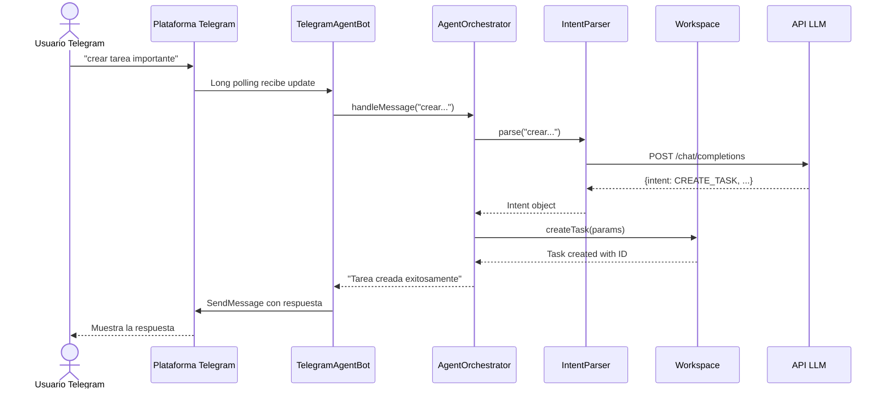

# Flujos de ejecucion

## Flujo de Telegram



## Flujo de la UI web

Cuando haces algo en el navegador, el flujo es simple:

1. **Navegador envia solicitud** a `/api/tasks` o `/api/assistant/chat`
2. **Backend recibe** en TaskController o AssistantController
3. **Se procesa** la logica mediante el orquestador
4. **Se accede** al workspace compartido (en memoria)
5. **Backend devuelve JSON** con el resultado
6. **Navegador actualiza** la interfaz

Despues de eso, el usuario ve el cambio reflejado al instante.

## Endpoints clave

### Task Management API

#### Listar todas las tareas
```http
GET /api/tasks
```

**Respuesta:**
```json
{
  "tasks": [
    {
      "id": "task-001",
      "name": "Implementar autenticacion",
      "description": "Agregar OAuth2",
      "status": "IN_PROGRESS",
      "createdAt": "2026-05-11T10:30:00Z"
    }
  ]
}
```

#### Crear una tarea
```http
POST /api/tasks
Content-Type: application/json

{
  "name": "Escribir documentacion",
  "description": "README actualizado"
}
```

**Respuesta:**
```json
{
  "id": "task-002",
  "name": "Escribir documentacion",
  "status": "PENDING",
  "createdAt": "2026-05-11T12:00:00Z"
}
```

### Chat/Assistant API

#### Enviar un mensaje al asistente
```http
POST /api/assistant/chat
Content-Type: application/json

{
  "message": "¿cuantas tareas tengo en progreso?"
}
```

**Respuesta:**
```json
{
  "response": "Tienes 2 tareas en progreso: 'Implementar autenticacion' y 'Testing del sistema'.",
  "intent": "LIST_TASKS_BY_STATUS",
  "confidence": 0.95
}
```

## Que pasa si algo falla

### La API de IA no responde
No es un problema. Si la API de Groq tarda o falla, el sistema automaticamente cambia al parser basado en reglas. El usuario escribe "crear tarea" y la tarea se crea de todos modos. Tal vez no entienda el contexto tan bien, pero funciona.

### El usuario escribe algo vago
Si alguien escribe solo "hola" o algo que no es claro, el sistema intenta interpretar. Si no puede, devuelve una respuesta por defecto amigable. El sistema nunca se queda sin responder.

## Nota operativa

Esta arquitectura prioriza **disponibilidad sobre precision**. Aunque el LLM tenga mejor precision en la interpretacion de intenciones, el fallback a reglas garantiza que el sistema nunca se queda sin funcionalidad basica. Es el principio de **graceful degradation**.